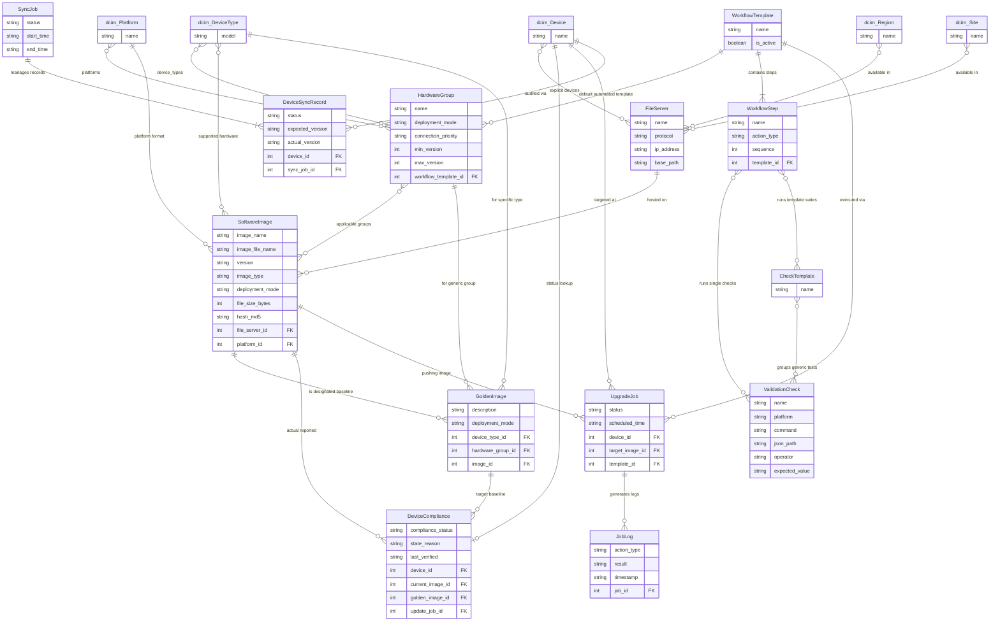

# NetBox SWIM (Software Image Management) Plugin

A NetBox plugin for managing firmware images, compliance baselines, and automated upgrade workflows across network infrastructure. Supports Scrapli, pyATS/Unicon, and Netmiko as connection backends.

## Features
- **Golden Image Definitions:** Define target software baselines scoped by Hardware Group or Device Type.
- **Device Sync & Diff:** Connects to devices via SSH, parses `show version` / `show inventory` / `dir flash:` output, and stores extracted facts as NetBox custom fields.
- **Workflow Templates:** Attach pre/post check sequences (e.g. `show ip bgp summary`, `show ip interface brief`) to upgrade pipelines.
- **Bulk Upgrades:** Queue non-compliant devices for firmware distribution and activation across sites, with dry-run and mock execution modes.

## Installation

### Docker (netbox-docker)
1. Add to `plugin_requirements.txt`:
   ```
   netbox-swim @ git+https://github.com/<your-org>/netbox-swim.git
   ```
2. Create `Dockerfile-Plugins`:
   ```dockerfile
   FROM netboxcommunity/netbox:latest
   COPY ./plugin_requirements.txt /opt/netbox/
   RUN /usr/local/bin/uv pip install --no-cache -r /opt/netbox/plugin_requirements.txt
   ```
3. Enable in `configuration/plugins.py`:
   ```python
   PLUGINS = ["netbox_swim"]
   ```
4. Set device credentials in `env/swim.env`:
   ```bash
   SWIM_USERNAME=your_ssh_user
   SWIM_PASSWORD=your_ssh_pass
   SWIM_SECRET=your_enable_secret
   ```
5. Build and start:
   ```bash
   docker compose build --no-cache && docker compose up -d
   ```

### Bare Metal
```bash
source /opt/netbox/venv/bin/activate
pip install netbox-swim                    # from PyPI
# OR: pip install git+https://github.com/<your-org>/netbox-swim.git
# OR: pip install -e /path/to/netbox-swim  # local development
cd /opt/netbox/netbox
python3 manage.py migrate
python3 manage.py collectstatic --no-input
sudo systemctl restart netbox netbox-rq
```

For the full setup guide (credential profiles, platform mapping, Docker upgrade process, troubleshooting), see [**Installation & Configuration**](docs/00-installation.md).

## Documentation

For detailed usage instructions, see the guides in the `docs/` folder:

0. [**Installation & Configuration**](docs/00-installation.md) – Plugin setup, credentials, platform mapping, custom fields, and troubleshooting.
1. [**Hardware Groups**](docs/01-hardware-groups.md) – Grouping platforms and device types, assigning workflow templates, and managing groups via API.
2. [**Software Images & File Servers**](docs/02-software-images.md) – Registering OS images, configuring file servers, setting up Golden Image baselines, and region-aware download scoping.
3. [**Workflows & Validation**](docs/03-workflows.md) – Building workflow step sequences, configuring `ping`/`wait` parameters, and grouping validation checks into templates.
4. [**Device Synchronization**](docs/04-device-sync.md) – Running sync jobs (auto-update vs. manual review), polling job status, and approving diffs via API.
5. [**Upgrades & Job Logs**](docs/05-device-upgrades.md) – Queuing upgrade jobs, execution modes (`mock`/`dry_run`/`execute`), dry-run pipeline analysis, and tailing live logs.

---

## Data Model Relationships

The following entity-relationship diagram illustrates how the plugin's data models interact with each other and with core NetBox models:


