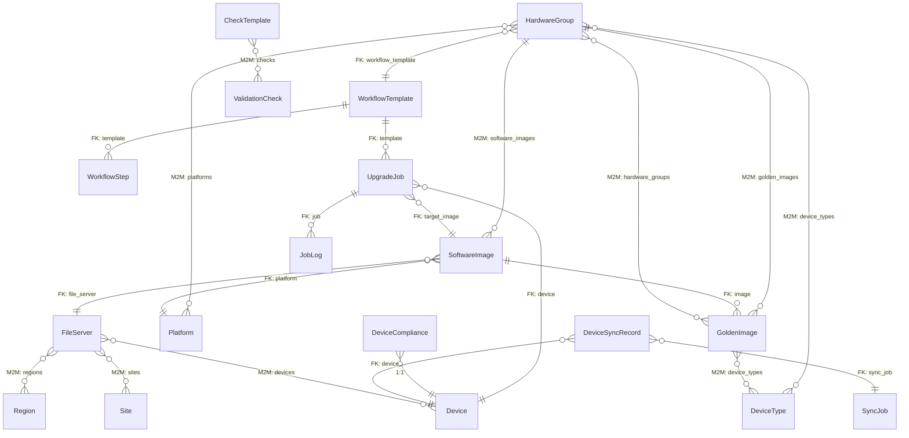

# Data Model Reference

This page documents every database model in the SWIM plugin, their fields, and relationships.

---

## Entity Relationship Diagram

---

## Pillar 1: Image Repository

### HardwareGroup

Groups network devices by platform, device type, and deployment mode.

| Field | Type | Description |
|-------|------|-------------|
| `name` | CharField(100) | Unique group name (e.g. "Campus Core C9300") |
| `slug` | SlugField(100) | URL-safe identifier |
| `platforms` | M2M → Platform | NetBox platforms this group targets |
| `device_types` | M2M → DeviceType | NetBox device types this group targets |
| `deployment_mode` | Choice | `campus` / `sdwan` / `universal` |
| `connection_priority` | CharField | Comma-separated SSH library order (e.g. `scrapli,netmiko,unicon`) |
| `workflow_template` | FK → WorkflowTemplate | The upgrade workflow assigned to devices in this group |
| `is_static` | Boolean | If true, membership is code-driven, not UI criteria |
| `manual_includes` | M2M → Device | Force-include specific devices |
| `manual_excludes` | M2M → Device | Force-exclude specific devices |
| `min_version` / `max_version` | CharField | Optional version range filter |

### FileServer

Represents a remote server where firmware images are stored.

| Field | Type | Description |
|-------|------|-------------|
| `name` | CharField(100) | Unique server name |
| `protocol` | Choice | `tftp` / `ftp` / `sftp` / `http` / `https` / `scp` |
| `ip_address` | CharField | Server IP or hostname |
| `port` | Integer | Optional custom port |
| `base_path` | CharField | Root directory on the server |
| `regions` | M2M → Region | Regional scope for file server resolution |
| `sites` | M2M → Site | Site-level scope |
| `devices` | M2M → Device | Device-specific override |
| `priority` | Integer | Lower = higher preference (default: 100) |
| `is_global_default` | Boolean | Last-resort fallback server |

**File Server Resolution Order:**
1. Device-specific match (`device in fs.devices`)
2. Site match (`device.site in fs.sites`)
3. Region match (`device.site.region in fs.regions`)
4. Global default (`is_global_default=True`)

### SoftwareImage

A specific firmware binary tracked in the repository.

| Field | Type | Description |
|-------|------|-------------|
| `image_name` | CharField | Display name (e.g. "Cat9k-IOS-XE-17.09.05") |
| `image_file_name` | CharField | Actual filename on the file server |
| `version` | CharField | Software version string |
| `image_type` | Choice | `software` / `smu` / `rommon` |
| `platform` | FK → Platform | Target platform |
| `file_server` | FK → FileServer | Where the image is hosted |
| `hardware_groups` | M2M → HardwareGroup | Compatible hardware groups |
| `device_types` | M2M → DeviceType | Compatible device types |
| `deployment_mode` | Choice | `campus` / `sdwan` / `universal` |
| `file_size_bytes` | BigInteger | Image file size |
| `hash_md5` / `hash_sha256` / `hash_sha512` | CharField | Integrity hashes |
| `min_ram_mb` / `min_flash_mb` | Integer | Minimum hardware requirements |
| `min_source_version` / `max_source_version` | CharField | Valid upgrade path range |

### GoldenImage

Designates a specific SoftwareImage as the standard baseline for a group of devices.

| Field | Type | Description |
|-------|------|-------------|
| `image` | FK → SoftwareImage | The blessed image version |
| `device_types` | M2M → DeviceType | Applicable device types |
| `hardware_groups` | M2M → HardwareGroup | Applicable hardware groups |
| `deployment_mode` | Choice | `campus` / `sdwan` / `universal` |

---

## Pillar 2: Compliance

### DeviceCompliance

One-to-one record tracking each device's compliance against its golden image.

| Field | Type | Description |
|-------|------|-------------|
| `device` | 1:1 → Device | The tracked device |
| `status` | Choice | `compliant` / `non_compliant` / `unknown` / `error` |
| `current_version` | CharField | Running software version |
| `expected_version` | CharField | Golden image version |
| `last_checked` | DateTime | Last compliance evaluation timestamp |

### ComplianceSnapshot

Daily aggregate for trend charting.

| Field | Type | Description |
|-------|------|-------------|
| `date` | DateField | Snapshot date (unique) |
| `total_devices` / `compliant` / `non_compliant` / `ahead` / `unknown` | Integer | Counts |

---

## Pillar 3: Workflows

### WorkflowTemplate

A named sequence of ordered steps defining an upgrade lifecycle.

| Field | Type | Description |
|-------|------|-------------|
| `name` | CharField | Template name (e.g. "Standard Campus Upgrade") |
| `is_active` | Boolean | Whether this template is available for use |

### WorkflowStep

A single step within a workflow template.

| Field | Type | Description |
|-------|------|-------------|
| `template` | FK → WorkflowTemplate | Parent template |
| `order` | Integer | Execution order (1, 2, 3...) |
| `action_type` | Choice | See Action Types table below |
| `extra_config` | JSONField | Step-specific overrides (connection_library, retries, duration, etc.) |

**Action Types:**

| Value | Display Name | SSH Required? | Description |
|-------|-------------|---------------|-------------|
| `readiness` | Readiness Evaluation | Yes | Check flash, RAM, reachability |
| `precheck` | Pre-Upgrade Validation | Yes | Capture operational state (BGP, OSPF, interfaces) |
| `distribution` | Distribute Image | Yes | Copy firmware to device flash |
| `activation` | Activate / Reboot | Yes | Install and reload the device |
| `wait` | Wait Timer | No | Configurable pause (uses `extra_config.duration`) |
| `ping` | Ping Reachability | No | ICMP/TCP:22 reachability check with retries |
| `postcheck` | Post-Upgrade Validation | Yes | Recapture operational state |
| `verification` | Verify Software Version | Yes | Confirm running version matches target |
| `report` | Generate Report | No | Summarize all step results |

---

## Pillar 4: Execution

### UpgradeJob

A single execution instance of a workflow for one device.

| Field | Type | Description |
|-------|------|-------------|
| `template` | FK → WorkflowTemplate | The workflow being executed |
| `device` | FK → Device | Target device |
| `target_image` | FK → SoftwareImage | Firmware to install |
| `status` | Choice | `pending` / `scheduled` / `running` / `completed` / `failed` |
| `scheduled_time` | DateTime | Optional future execution time |
| `start_time` / `end_time` | DateTime | Execution window |
| `job_log` | JSONField | Engine activity timeline entries |
| `extra_config` | JSONField | Runtime overrides (dry_run, mock_run, connection_priority_override) |

### JobLog

Per-step execution log entry for an upgrade job.

| Field | Type | Description |
|-------|------|-------------|
| `job` | FK → UpgradeJob | Parent job |
| `action_type` | CharField | Step type that was executed |
| `is_success` | Boolean | Pass/fail result |
| `log_output` | TextField | Full CLI output and diagnostic messages |
| `timestamp` | DateTime | When this step completed |

---

## Pillar 5: Sync & Drift

### SyncJob

Tracks a bulk synchronization operation across multiple devices.

| Field | Type | Description |
|-------|------|-------------|
| `status` | CharField | `running` / `completed` / `failed` / `aborted` / `cancelled` |
| `connection_library` | CharField | SSH library used |
| `max_concurrency` | Integer | Thread pool size |
| `selected_device_count` / `failed_device_count` | Integer | Counts |
| `summary_logs` | JSONField | Per-device result messages |

### DeviceSyncRecord

Individual device sync result showing what changed between NetBox and the live device.

| Field | Type | Description |
|-------|------|-------------|
| `device` | FK → Device | The synced device |
| `sync_job` | FK → SyncJob | Parent bulk job (optional) |
| `status` | Choice | `syncing` / `pending` / `applied` / `auto_applied` / `no_change` / `failed` |
| `detected_diff` | JSONField | Dictionary of `{field: {old: X, new: Y}}` differences |
| `live_facts` | JSONField | Raw device facts collected via SSH |
| `log_messages` | JSONField | Execution log lines |

---

## Validation & Checks

### ValidationCheck

A specific operational check (Genie feature, CLI command, or Python script).

| Field | Type | Description |
|-------|------|-------------|
| `name` | CharField | Check name (e.g. "BGP Neighbors") |
| `category` | Choice | `genie` / `command` / `script` |
| `command` | CharField | The genie feature or CLI command string |
| `phase` | Choice | `pre` / `post` / `both` |

### CheckTemplate

A reusable bundle of ValidationChecks assigned to workflow steps.

| Field | Type | Description |
|-------|------|-------------|
| `name` | CharField | Template name (e.g. "Full Campus Checks") |
| `checks` | M2M → ValidationCheck | Included checks |

---

## Custom Fields (on dcim.Device)

These are auto-registered on plugin startup:

| Custom Field | Type | Description |
|-------------|------|-------------|
| `deployment_mode` | Select | Campus / SD-WAN / Universal |
| `software_version` | Text | Currently running OS version |
| `tacacs_source_interface` | Text | Discovered TACACS+ source-interface |
| `tacacs_source_ip` | Text | Discovered TACACS+ source IP |
| `vrf` | Text | Discovered VRF routing instance |
| `swim_last_sync_status` | Select | success / error / pending |
| `swim_last_successful_sync` | DateTime | Timestamp of last good sync |

---

## Platform Mapping (constants.py)

The `PLATFORM_MAPPINGS` dictionary translates NetBox platform slugs to library-specific identifiers:

| NetBox Slug | Scrapli | Netmiko | Unicon | TextFSM | Genie |
|-------------|---------|---------|--------|---------|-------|
| `cisco-ios-xe` | `cisco_iosxe` | `cisco_ios` | `iosxe` | `cisco_ios` | `iosxe` |
| `cisco-nx-os` | `cisco_nxos` | `cisco_nxos` | `nxos` | `cisco_nxos` | `nxos` |
| `juniper-junos` | `juniper_junos` | `juniper_junos` | `junos` | `juniper_junos` | `junos` |
| `arista-eos` | `arista_eos` | `arista_eos` | `eos` | `arista_eos` | `eos` |
| `paloalto-panos` | `paloalto_panos` | `paloalto_panos` | `panos` | `paloalto_panos` | `panos` |
