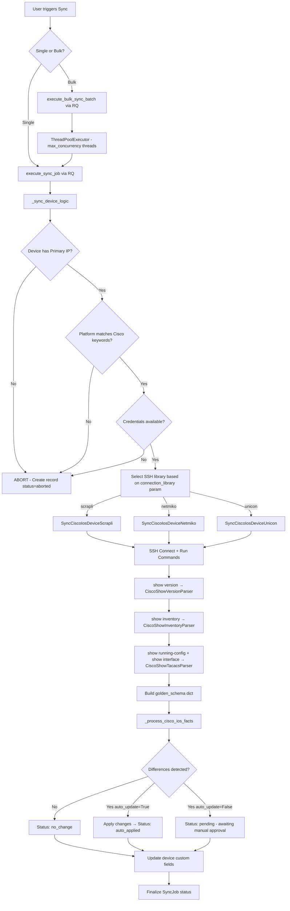
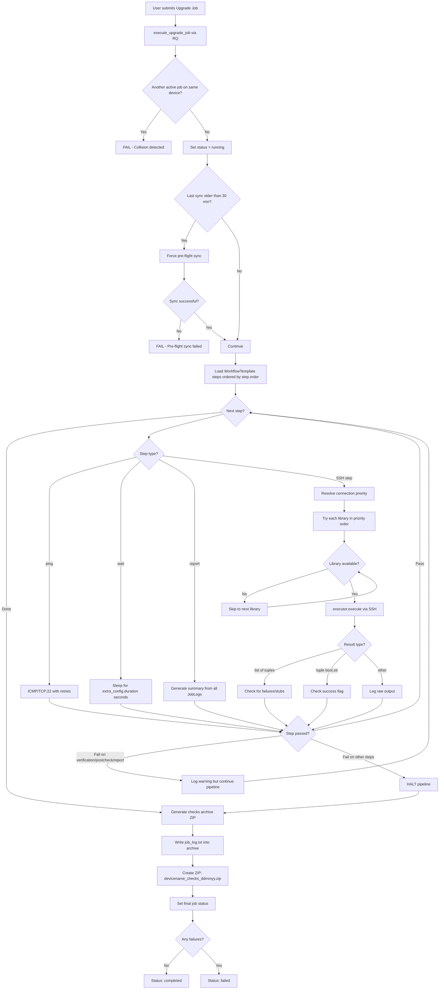
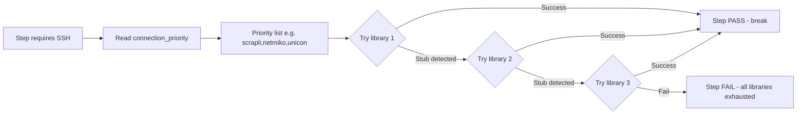
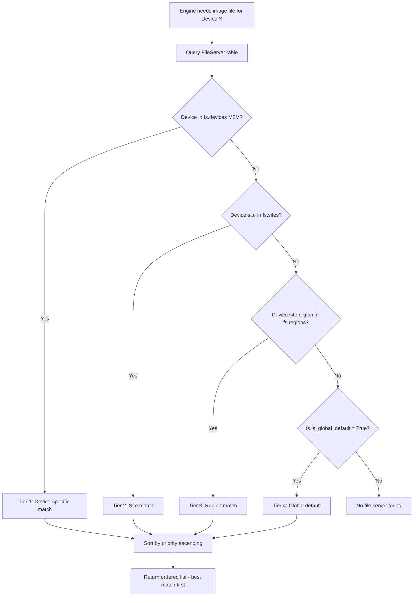
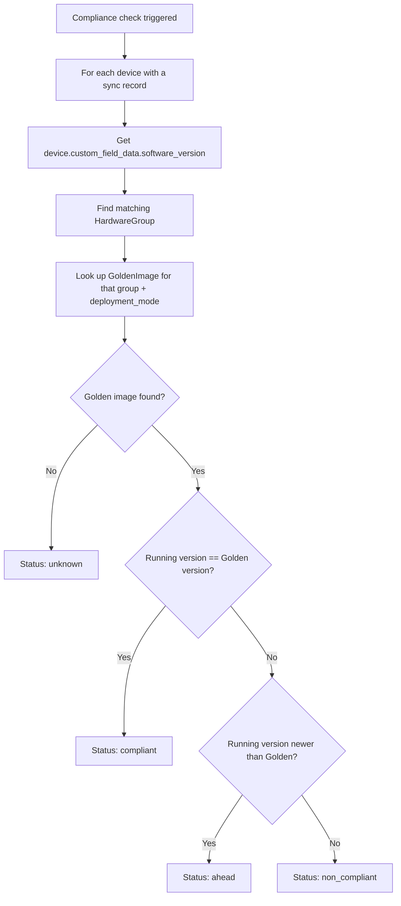
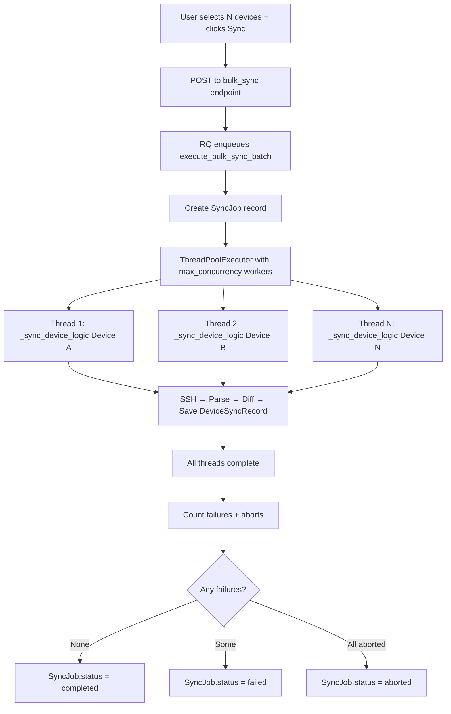

# Process Flow Diagrams

This page contains visual diagrams for the core operational workflows in the SWIM plugin.

---

## 1. Device Sync Flow

The sync operation collects live facts from a device via SSH and compares them against NetBox records.



---

## 2. Upgrade Job Lifecycle

The upgrade job executes a full workflow template step by step.



---

## 3. Connection Library Fallback

Each SSH-requiring step tries connection libraries in priority order:



**Priority Resolution Order:**
1. `extra_config.connection_library` on the WorkflowStep (highest)
2. `extra_config.connection_priority_override` on the UpgradeJob
3. `HardwareGroup.connection_priority` field
4. Default: `scrapli,netmiko,unicon`

---

## 4. File Server Resolution

When the engine needs to locate a firmware image for a device:



---

## 5. Compliance Evaluation



---

## 6. Bulk Sync Architecture



---

## 7. Checks Archive ZIP Structure

After an upgrade job completes, a diagnostic archive is generated:

```
C9K-SWI01_checks_260326.zip
├── precheck/
│   ├── bgp_summary.txt
│   ├── ospf_neighbors.txt
│   ├── interface_status.txt
│   └── ...
├── postcheck/
│   ├── bgp_summary.txt
│   ├── ospf_neighbors.txt
│   ├── interface_status.txt
│   └── ...
├── diffs/
│   ├── diff_bgp_summary.txt
│   ├── diff_ospf_neighbors.txt
│   └── summary.log
└── job_log.txt
```

The `diffs/` folder is generated either by:
- **Genie diff CLI** (preferred — structured parsing)
- **Python difflib** (fallback — text-based unified diff)
